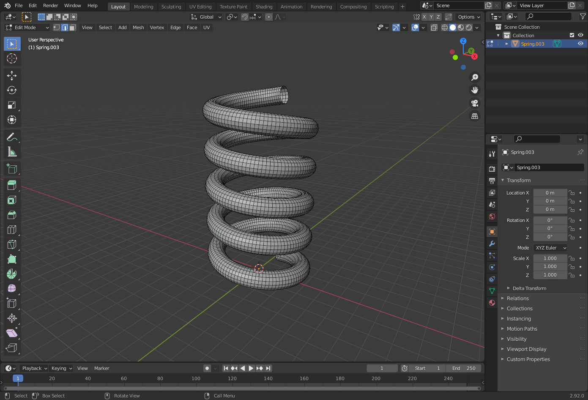

## Blender add on to create coiled springs

Create coiled spring meshes in blender using this addon. 

## Install Addon

## Usage
1. Install the Addon and Enable it
2. 'Add Coiled Sprint' option should now be available in your Add menu (`Shift+A`) 

## Demo

## Screenshots

